# 🚑 Smart ASHA Connect  
## Digital Rural Healthcare Intelligence Platform  

A Progressive Web Application (PWA) built for ASHA Karyakartas to digitize patient surveys, emergency response, preventive screening, and real-time healthcare coordination across rural India
Vercel Deployement : https://asha-ai-nine.vercel.app/

---

  <b>🩺 Real-Time Monitoring</b> • 
  <b>🚨 Emergency SOS</b> • 
  <b>📊 Health Analytics</b> • 
  <b>🧠 AI Assistance</b> • 
  <b>🌐 Multilingual Support</b>

---

# 🌍 Vision

To transform India's rural healthcare infrastructure by equipping ASHA workers with a smart, data-driven, tablet-based digital ecosystem.

---

# 🚀 Why Smart ASHA Connect?

Traditional rural healthcare systems suffer from:

- Paper-based survey records
- No centralized health database
- Delayed emergency response
- Poor tracking of follow-ups
- Weak coordination between field workers and hospitals

Smart ASHA Connect digitizes the entire workflow.

---

# 🧩 System Architecture

---

# 🔐 Role-Based Access

### 👩‍⚕️ ASHA Worker Login
- Login using ASHA ID
- Access Smart ASHA Dashboard

### 👨‍💼 Admin Login

---

# 📸 Application Walkthrough

---

## 1️⃣ Login Interface

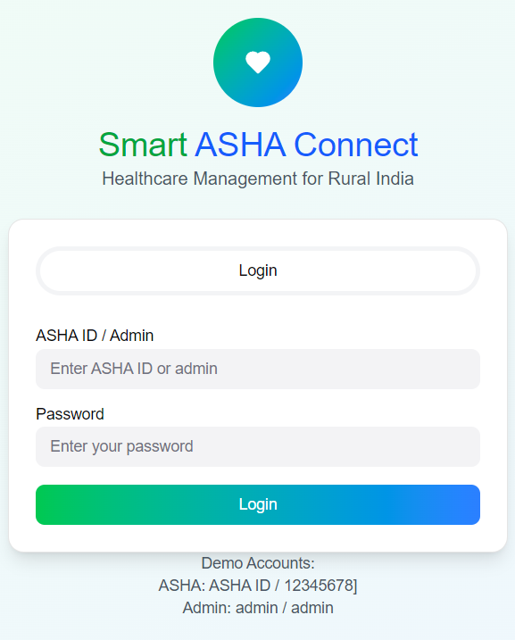

- Role-based access
- Secure session flow
- Healthcare branding

---

## 2️⃣ Smart ASHA Dashboard

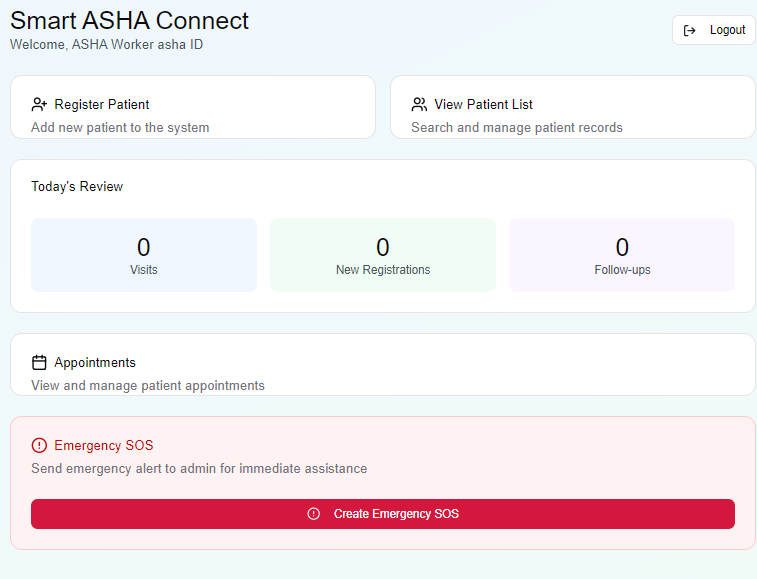

### Dashboard Includes:
- Register Patient
- View Patient Records
- Today's Visit Stats
- SOS Button
- Appointments
- Notifications
- Multilingual Chatbot

---

## 3️⃣ Patient Registration

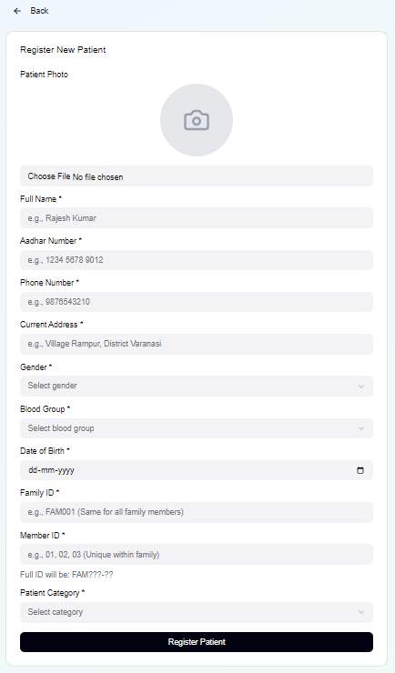

**Captured Data:**
- Name
- Aadhaar
- Phone
- Address
- Gender
- Blood Group
- DOB
- Live Photo Capture

All data stored in centralized database.

---

## 4️⃣ Patient List & Search

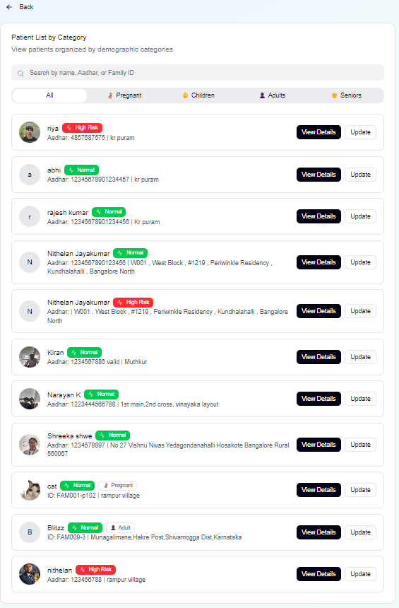

- Search by Aadhaar / Name
- Access Full Health History
- Navigate to Update

---

## 5️⃣ Patient Health History (Graph View)

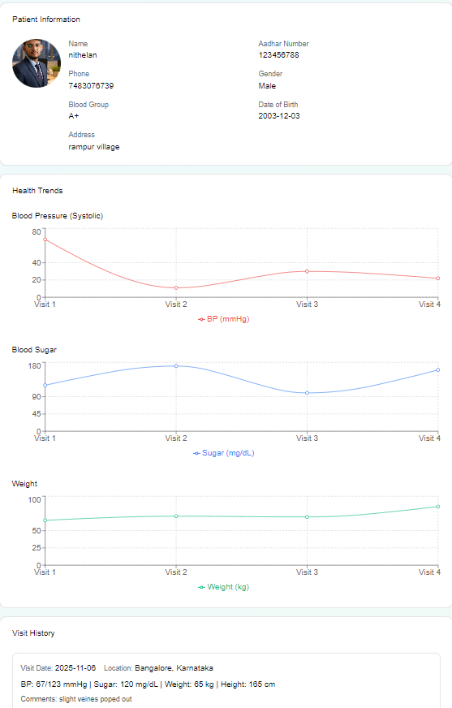

- Blood Pressure Trends
- Sugar Level Monitoring
- Weight Tracking
- Visit Timeline

---

## 6️⃣ Visit Update & Screening Module

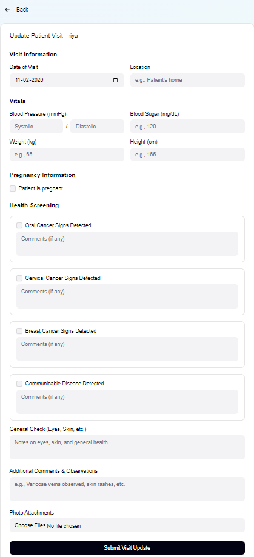

### Vitals Recorded:
- BP
- Sugar
- Height
- Weight
- Pregnancy Info (if applicable)

### Screening Includes:
- Oral Cancer
- Cervical Cancer
- Breast Cancer
- Communicable Diseases
- General Health Check
- Image Attachments

---

## 7️⃣ Emergency SOS Workflow

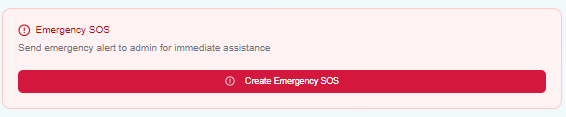

### Emergency Flow:
1. Select Patient
2. Confirm SOS
3. Alert Sent to Admin
4. Ambulance Assigned
5. Doctor Assigned

---

## 8️⃣ Appointment Management

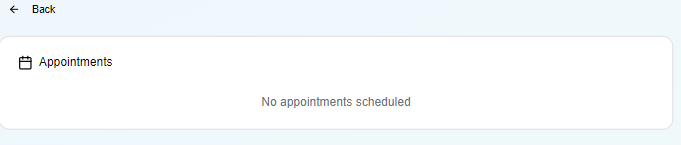

- Admin-assigned visits
- ASHA completion tracking
- Real-time status updates

---

## 9️⃣ Multilingual AI Chatbot

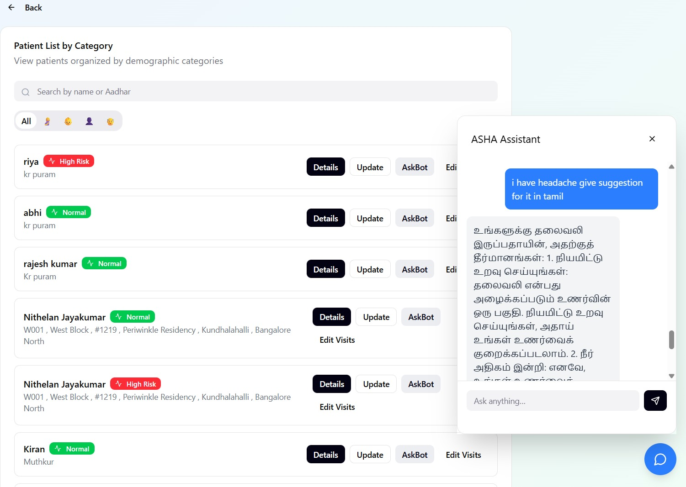

### Supported Languages:
- English
- Kannada
- Hindi (Extendable)

Helps ASHA workers with:
- Medical doubts
- Screening guidance
- Symptom assistance

---

## 🔔 10️⃣ Notifications & Announcements

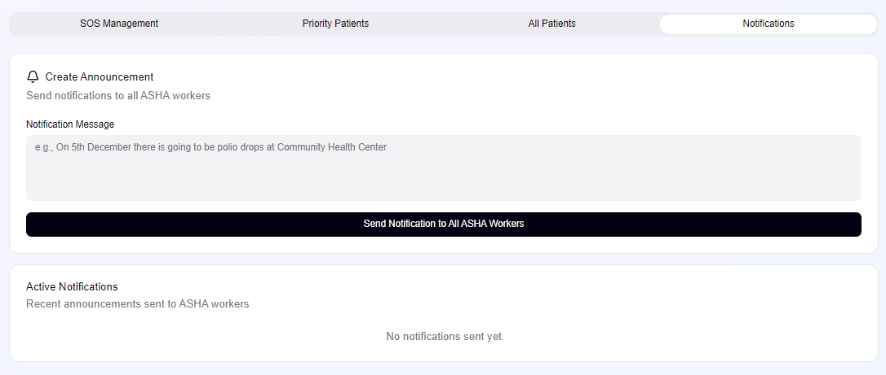

Admin can broadcast:
- Vaccination drives
- Health camps
- Emergency alerts

Instantly visible on ASHA dashboard.

---

# 🧑‍⚕️ Admin Control Panel

---

## 11️⃣ Admin Dashboard

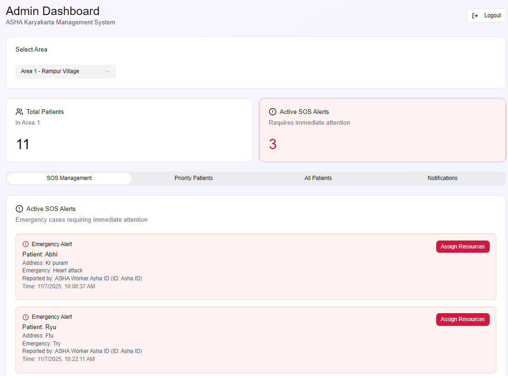

Features:
- Total Patients Overview
- Area Selection
- Active SOS Alerts
- Severity-Based Priority List

---

## 12️⃣ Doctor Assignment System

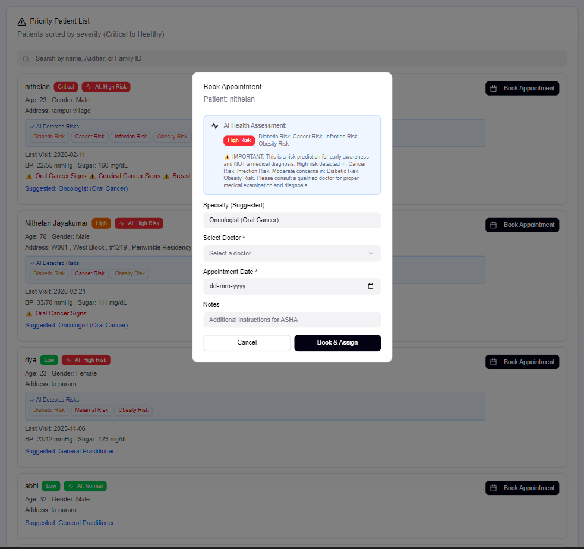

### Doctor Availability Indicators:
- 🟢 Available
- 🟡 Busy
- 🔴 Limited

Doctors suggested based on:
- Symptoms
- Screening Results
- Severity Score

---

# 🧠 Intelligent Prioritization Engine

Patients are ranked based on:

- Cancer Screening Results
- Communicable Disease Flags
- High BP / Sugar Levels
- Critical Emergency Cases

Enables data-driven doctor allocation.

---

# 🌐 Multilingual Support

Smart ASHA Connect supports:

- English
- Kannada
- Hindi
- Easily extendable to regional languages

Ensures inclusivity across diverse rural regions.

---

# 📊 Key Capabilities

- Installable Progressive Web App
- Real-time Cloud Sync
- Emergency Alert Routing
- Preventive Screening Digitization
- Doctor Allocation Intelligence
- Centralized Rural Health Analytics
- Multilingual AI Assistance

---

# 📈 Impact Potential

- Faster emergency response
- Reduced preventable diseases
- Centralized patient intelligence
- Scalable nationwide healthcare deployment
- Data-driven rural health governance

---

# 🔮 Future Scope

- AI Disease Prediction Model
- GPS Visit Tracking
- Offline Sync Capability
- Government Health API Integration
- Biometric Authentication

---

# 📂 Project Structure

---

# 👨‍💻 Team

Smart ASHA Connect Development Team :
Nithelan Jayakumar
Abhishek Mannatharaj
Abdul Shuaib
M M Bharath

---

# 📌 Conclusion

Smart ASHA Connect is a scalable, intelligent, and multilingual digital healthcare platform designed to modernize India’s rural ASHA ecosystem through real-time data, preventive screening, and emergency optimization.

---
